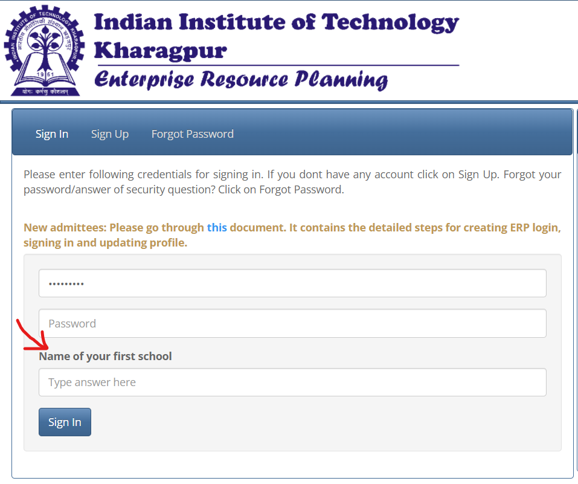

STEP 1 : Go to loginData.py file and open it in an IDE.
STEP 2 : Follow the instructions given there inside.

NOTE : The questions are the ones which come as security questions like "Name your favorite actor", "Name your first School" etc. Mention the questions exactly as they are(word to word) and their corresponding answers.

WOILA !! RUN the autoERPlogin.exe file and enjoy logging in ERP automatically without the hastle of typing everything afresh, everytime.
